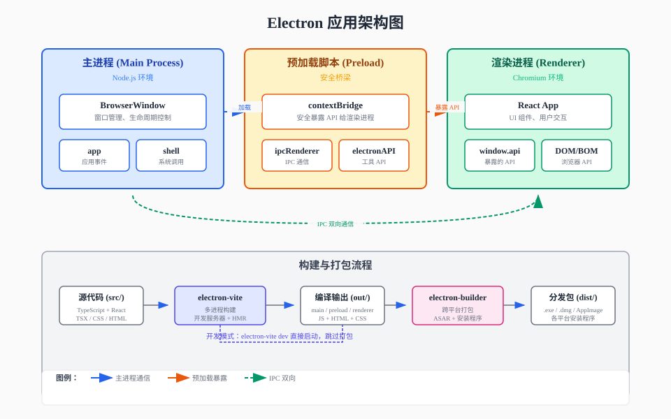
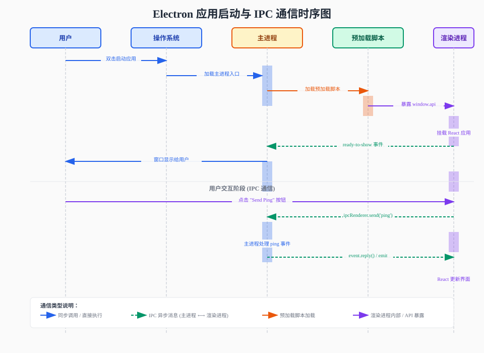
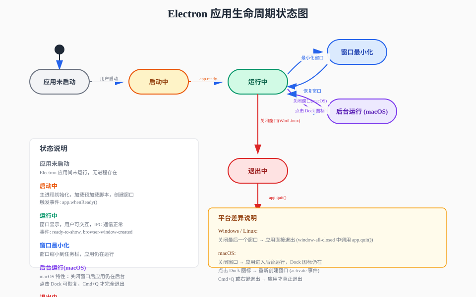

# Electron Scaffold 技术文档

本文档包含 Electron 应用的技术架构说明，通过图表展示应用的运行时结构、通信流程和生命周期状态。

---

## 目录

1. [架构图](#架构图) — 应用整体架构与构建流程
2. [时序图](#时序图) — 启动过程与 IPC 通信流程
3. [状态图](#状态图) — 应用生命周期与状态转换
4. [IPC 通信详解](#ipc-通信详解)

---

## 架构图



### 说明

Electron 应用采用**多进程架构**，分为三个核心进程：

| 进程 | 运行环境 | 职责 |
|------|----------|------|
| **主进程 (Main)** | Node.js | 应用入口、窗口管理、系统API调用、IPC处理 |
| **预加载脚本 (Preload)** | 隔离上下文 | 安全桥梁，选择性暴露主进程API给渲染进程 |
| **渲染进程 (Renderer)** | Chromium | UI渲染、用户交互、通过暴露的API与主进程通信 |

### 构建流程

```
src/ (TypeScript + React)
    ↓
electron-vite (多进程构建 + 开发服务器)
    ↓
out/ (编译后的 JS + HTML + CSS)
    ↓
electron-builder (跨平台打包)
    ↓
dist/ (各平台安装程序 .exe / .dmg / AppImage)
```

### 安全设计

- **上下文隔离 (Context Isolation)**：预加载脚本与渲染进程运行在不同上下文，防止渲染进程直接访问 Node.js API
- **ContextBridge**：只暴露必要的 API，而非完整的 `ipcRenderer`
- **Sandbox**：可选开启 Chromium 沙箱，进一步限制渲染进程权限

---

## 时序图



### 启动阶段

1. **用户双击应用图标** → 操作系统加载 Electron 主进程
2. **主进程执行** `app.whenReady()` → 创建 `BrowserWindow`
3. **窗口创建时** → 加载预加载脚本 (`preload/index.js`)
4. **预加载脚本** → 通过 `contextBridge` 将 API 暴露到 `window` 对象
5. **渲染进程** → 加载 HTML，挂载 React 应用
6. **窗口就绪** → 触发 `ready-to-show` 事件，主进程调用 `window.show()`

### IPC 通信阶段

```
渲染进程 (React)          主进程 (Node.js)
     |                           |
     |-- ipcRenderer.send() --->|
     |    channel: 'ping'        |
     |                           |-- 处理事件
     |<-- event.reply() --------|
     |                           |
     |-- 更新 React UI           |
```

### 通信方式对比

| 方式 | 方向 | 方法 | 特点 |
|------|------|------|------|
| **单向发送** | 渲染 → 主 | `ipcRenderer.send(channel, data)` | 发完即走，不等待响应 |
| **异步调用** | 渲染 → 主 | `ipcRenderer.invoke(channel, data)` | 返回 Promise，可等待结果 |
| **主进程主动** | 主 → 渲染 | `webContents.send(channel, data)` | 主进程向指定窗口发送消息 |

---

## 状态图



### 生命周期状态

| 状态 | 说明 | 触发条件 |
|------|------|----------|
| **应用未启动** | 无进程运行 | 初始状态 |
| **启动中** | 主进程初始化、加载脚本、创建窗口 | 用户启动应用 |
| **运行中** | 窗口显示，可交互 | `app.whenReady()` 完成 |
| **窗口最小化** | 窗口缩小到任务栏 | 用户点击最小化按钮 |
| **后台运行** | macOS 特有，关闭窗口但应用仍在运行 | macOS 用户关闭窗口 |
| **退出中** | 清理资源、关闭进程 | 用户退出应用 |
| **已退出** | 进程结束 | `app.quit()` 执行完毕 |

### 平台差异

**Windows / Linux：**
- 关闭最后一个窗口 → 应用直接退出
- 对应代码：`app.on('window-all-closed', () => app.quit())`

**macOS：**
- 关闭窗口 → 应用进入后台运行（Dock 图标仍在）
- 点击 Dock 图标 → 重新创建窗口
- Cmd+Q → 应用真正退出
- 对应代码：`app.on('activate', () => createWindow())`

---

## IPC 通信详解

### 添加新的 IPC 通道步骤

以添加一个 "读取文件" 功能为例：

#### 1. 主进程注册处理程序 (`src/main/index.ts`)

```typescript
import { ipcMain, dialog } from 'electron'
import { readFileSync } from 'fs'

// 在 app.whenReady() 中注册
ipcMain.handle('read-file', async (_, filePath: string) => {
  try {
    const content = readFileSync(filePath, 'utf-8')
    return { success: true, content }
  } catch (error) {
    return { success: false, error: error.message }
  }
})
```

#### 2. 预加载脚本暴露 API (`src/preload/index.ts`)

```typescript
const api = {
  ping: () => ipcRenderer.invoke('ping'),
  // 新增：暴露读取文件方法
  readFile: (filePath: string) => ipcRenderer.invoke('read-file', filePath)
}
```

#### 3. 类型声明 (`src/preload/index.d.ts`)

```typescript
declare global {
  interface Window {
    electron: ElectronAPI
    api: {
      ping: () => Promise<void>
      readFile: (filePath: string) => Promise<{ success: boolean; content?: string; error?: string }>
    }
  }
}
```

#### 4. 渲染进程调用 (`src/renderer/src/App.tsx`)

```typescript
async function handleReadFile() {
  const result = await window.api.readFile('/path/to/file.txt')
  if (result.success) {
    console.log('文件内容:', result.content)
  } else {
    console.error('读取失败:', result.error)
  }
}
```

### 安全最佳实践

1. **永远不要直接暴露 `ipcRenderer`** — 使用 `contextBridge` 封装具体方法
2. **验证所有输入参数** — 主进程中检查参数类型和范围
3. **使用 `invoke/handle` 而非 `send/on`** — 前者有错误处理机制
4. **限制通道白名单** — 只暴露应用需要的功能
5. **避免在预加载脚本中执行敏感操作** — 只作为桥梁，业务逻辑放在主进程

---

## 文件对应关系

| 文档 | 文件 | 说明 |
|------|------|------|
| 架构图 | [architecture.svg](./architecture.svg) | 多进程架构与构建流程 |
| 时序图 | [sequence.svg](./sequence.svg) | 启动与 IPC 通信时序 |
| 状态图 | [state.svg](./state.svg) | 应用生命周期状态转换 |
| 本文档 | [README.md](./README.md) | 技术文档总览 |
